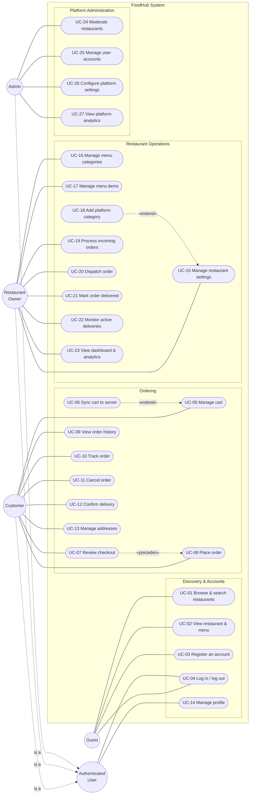
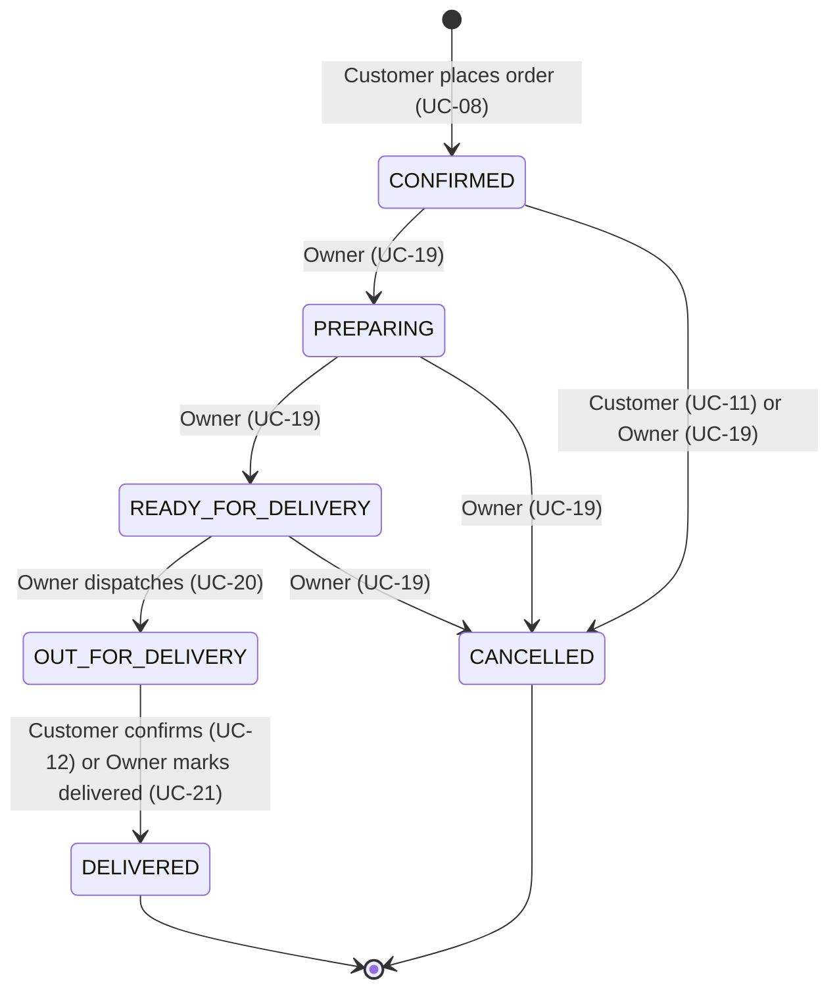
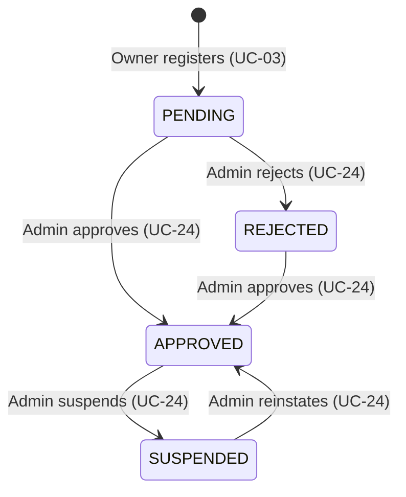

# FoodHub — Use Cases

FoodHub is a food-delivery platform with three sides: **customers** browse approved restaurants,
order with cash on delivery and track their orders; **restaurant owners** run their menu, kitchen
and delivery workflow; **admins** approve restaurants, moderate accounts and watch platform-wide
metrics. The system is a Spring Boot API (`food-backend`) consumed by a React/Vite web client
(`foodhub-main`).

Every use case below is derived from the code as it stands today — the controllers under
`src/main/java/com/food/foodapp/**/controller`, the services they delegate to, and the entity state
machines — not from plans. Features that were built and later removed (coupons, reviews, password
reset, favorites — see migrations `V8`, `V10`, `V11`, `V16`) are deliberately absent.

**Conventions**

- All endpoint paths are relative to `/api/v1`.
- HTTP codes in exception flows are the ones `GlobalExceptionHandler` actually returns.
- "Orderable" means a restaurant is `APPROVED` **and** inside its business hours right now
  (`RestaurantService.isCustomerVisible`). "Readable" means only `APPROVED`, open or closed.

---

## 1. Actors

| Actor | Definition | How the account comes to exist |
|---|---|---|
| **Guest** | Anonymous visitor. | — |
| **Customer** | User with `role = CUSTOMER`. | Self-registration (UC-03). |
| **Restaurant Owner** | User with `role = OWNER`. Owns exactly one restaurant, created in `PENDING` state at registration. | Self-registration (UC-03), only while the admin allows restaurant registration. |
| **Admin** | User with `role = ADMIN`. | Never via registration. The first admin is seeded at startup by `AdminAccountInitializer` from `app.admin.bootstrap.*` properties; further admins are promoted directly in the database. |
| **Authenticated User** | Abstract generalization of Customer, Owner and Admin, used for use cases every signed-in user shares. | — |

There is **no courier actor**. Delivery is confirmed by either the customer or the owner; the
courier's name is an optional free-text field the owner fills in at dispatch.

---

## 2. Use Case Summary

| ID | Use case | Primary actor |
|---|---|---|
| UC-01 | Browse & search restaurants | Guest |
| UC-02 | View restaurant & menu | Guest |
| UC-03 | Register an account | Guest |
| UC-04 | Log in / log out | Guest → Authenticated User |
| UC-05 | Manage cart | Customer |
| UC-06 | Sync cart to server | Customer |
| UC-07 | Review checkout (preview) | Customer |
| UC-08 | Place order | Customer |
| UC-09 | View order history & details | Customer |
| UC-10 | Track order | Customer |
| UC-11 | Cancel order | Customer |
| UC-12 | Confirm delivery (customer side) | Customer |
| UC-13 | Manage delivery addresses | Customer |
| UC-14 | Manage profile | Authenticated User |
| UC-15 | Manage restaurant settings & hours | Owner |
| UC-16 | Manage menu categories | Owner |
| UC-17 | Manage menu items | Owner |
| UC-18 | Add a platform cuisine category | Owner |
| UC-19 | Process incoming orders | Owner |
| UC-20 | Dispatch order to courier | Owner |
| UC-21 | Mark order delivered (owner side) | Owner |
| UC-22 | Monitor active deliveries | Owner |
| UC-23 | View restaurant dashboard & analytics | Owner |
| UC-24 | Moderate restaurants | Admin |
| UC-25 | Manage user accounts | Admin |
| UC-26 | Configure platform settings | Admin |
| UC-27 | View platform analytics | Admin |

---

## 3. Use Case Diagram

---

## 4. Lifecycles the Use Cases Drive

### 4.1 Order status (`OrderStatus`)

Every status change goes through `OrderStatus.canTransitionTo`. An illegal move returns
`409 Conflict`. See [`DELIVERY_WORKFLOW.md`](../DELIVERY_WORKFLOW.md) for the concurrency design
behind the two delivery-confirmation paths.

### 4.2 Restaurant approval (`RestaurantApprovalStatus`)

### 4.3 User account status (`UserStatus`)

`ACTIVE ⇄ SUSPENDED`, changed only by an admin (UC-25).

---

## 5. Guest Use Cases

### UC-01 — Browse & Search Restaurants

- **Primary actor:** Guest (the endpoints are public, so every actor can use them).
- **Goal:** Find a restaurant to order from.
- **Preconditions:** None.
- **Main flow:**
  1. The actor opens the home page; the system lists the platform cuisine categories, sorted by
     name (`GET /categories`).
  2. The system lists restaurants (`GET /restaurants`), paginated (default `size=20`, max `50`).
  3. The actor optionally searches by name or cuisine (`q`), filters by a category slug
     (`category=pizza`), and/or sorts by `delivery_time` or `delivery_fee`.
  4. The system returns only `APPROVED` restaurants. Each one carries `openForOrders`, computed
     from its business hours, so the UI can grey out closed restaurants instead of hiding them.
- **Exception flows:**

  | Condition | Result |
  |---|---|
  | Unknown `sort` value, `page < 0`, or `size` outside 1–50 | `400` |

- **Postconditions:** None (read-only).
- **Implemented by:** `CategoryController`, `RestaurantController` → `RestaurantService#searchRestaurants`.

### UC-02 — View Restaurant & Menu

- **Primary actor:** Guest.
- **Goal:** See a restaurant's details, dishes and prices before ordering.
- **Preconditions:** The restaurant is `APPROVED` (open or closed).
- **Main flow:**
  1. The actor opens a restaurant (`GET /restaurants/{id}`).
  2. The system returns the menu (`GET /restaurants/{restaurantId}/menu`): the tab names (the
     restaurant's *active* menu categories, in the owner's display order) plus the items.
  3. The actor may list the tabs alone (`GET .../menu/categories`) or the items of one tab
     (`GET .../menu/items?categoryId=`).
- **Exception flows:**

  | Condition | Result |
  |---|---|
  | Restaurant doesn't exist, or is `PENDING` / `REJECTED` / `SUSPENDED` | `404` (these cases look the same to the caller) |
  | `categoryId` belongs to another restaurant or is hidden (`active = false`) | `404` |

- **Postconditions:** None (read-only).
- **Implemented by:** `RestaurantController`, `MenuController`, `MenuCategoryController`.

### UC-03 — Register an Account

- **Primary actor:** Guest.
- **Goal:** Create a Customer or Restaurant Owner account.
- **Preconditions:** None.
- **Main flow:**
  1. The guest submits `name`, `email`, `password`, an optional `phone`, and `role`
     (`CUSTOMER` or `OWNER`) to `POST /auth/register`.
  2. *If `role = OWNER`:* the guest also submits `restaurantName` and a platform `categoryId`.
  3. The system trims and lowercases the email, checks it is unique, hashes the password, and saves
     the user as `ACTIVE`.
  4. *If `role = OWNER`:* in the same transaction, the system creates the owner's restaurant with
     `approval_status = PENDING`, delivery fee `0`, minimum order `0`, an estimated delivery time of
     30–60 min, and the chosen category.
  5. The system responds `201` with "Registration successful". **No session is started**, so the
     user continues with UC-04.
- **Exception flows:**

  | Condition | Result |
  |---|---|
  | `role` is `ADMIN` or anything other than `CUSTOMER`/`OWNER` | `400` |
  | `OWNER` while the admin has closed restaurant registration (UC-26) | `403` |
  | `OWNER` without `restaurantName` or `categoryId` | `400` |
  | `categoryId` doesn't exist | `404` (nothing is saved) |
  | Email already registered | `409` |
  | Bean-validation failure (blank name, malformed email, …) | `400` |

- **Postconditions:** The user exists. An owner's restaurant stays invisible to the public until an
  admin approves it (UC-24), but the owner can already set it up (UC-15 – UC-17).
- **Implemented by:** `AuthController#register` → `AuthService#register`.

### UC-04 — Log In / Log Out

- **Primary actor:** Guest (log in); Authenticated User (log out, session restore).
- **Goal:** Start or end an authenticated session.
- **Preconditions:** For log-in, a registered account.
- **Main flow — log in:**
  1. The guest submits `email` + `password` (`POST /auth/login`).
  2. The system checks the credentials, then checks that the account isn't suspended.
  3. The system issues a JWT, both as an `HttpOnly` `auth_token` cookie and in the response body,
     so non-browser clients can send `Authorization: Bearer <token>` instead. The response also
     includes the user's id, name, email, phone and role.
  4. On later page loads, the web client restores the session with `GET /auth/me`.
- **Main flow — log out:** `POST /auth/logout` clears the cookie (`Max-Age=0`).
- **Exception flows:**

  | Condition | Result |
  |---|---|
  | Unknown email **or** wrong password | `401` with the same message for both |
  | Correct password but account `SUSPENDED` | `403`. This is checked only after the password matches, so a suspension isn't revealed to someone who doesn't know the password. |
  | `GET /auth/me` without a valid token | `401` |

- **Extension point:** Once a customer is signed in, the web client pushes the browser-side cart to
  the server (UC-06).
- **Implemented by:** `AuthController` → `AuthService#login`, `ProfileService#getCurrentProfile`.

---

## 6. Customer Use Cases

### UC-05 — Manage Cart

- **Primary actor:** Customer. In the web client a guest can also build a cart; it lives in the
  browser until they sign in and UC-06 pushes it to the server.
- **Goal:** Build up the items to order.
- **Preconditions:** Authenticated (for the server cart).
- **Main flow:**
  1. View the cart (`GET /cart`). A cart row is created on first access.
  2. Add an item (`POST /cart/items` with `menuItemId`, `quantity`). If the item is already in the
     cart, the quantities are added together.
  3. Change a line's quantity (`PATCH /cart/items/{cartItemId}`).
  4. Remove a line (`DELETE /cart/items/{cartItemId}`). Removing the last line detaches the cart
     from its restaurant.
  5. Clear the cart (`DELETE /cart`).
- **Business rules:**
  - A cart holds items from **one restaurant only**.
  - Each line's quantity is 1–50, including the combined quantity after an add.
  - Only available items from an orderable restaurant can be added.
  - **Automatic cleanup:** on every read or change, lines whose item has become unavailable are
    removed. If the restaurant is no longer orderable (suspended, or now outside its hours), the
    whole cart is emptied.
  - Every change locks the cart row (`PESSIMISTIC_WRITE`), so rapid repeated taps are processed one
    at a time.
- **Exception flows:**

  | Condition | Result |
  |---|---|
  | Item belongs to a different restaurant than the current cart | `409` (the cart must be cleared first) |
  | Menu item doesn't exist | `404` |
  | Menu item unavailable | `409` |
  | Restaurant not approved or currently closed | `404` |
  | Combined line quantity would exceed 50 | `400` |
  | `cartItemId` isn't in the caller's cart | `404` |
  | Not authenticated | `401` |

- **Implemented by:** `CartController` → `CartService`.

### UC-06 — Sync Cart to Server

- **Primary actor:** Customer (usually triggered automatically by the web client).
- **Goal:** Make the server cart match the cart the client is holding, so totals and delivery fees
  come from the server.
- **Trigger:** The customer signs in, changes the local cart while signed in, or opens checkout.
- **Main flow:**
  1. The client sends the whole cart (`POST /cart/sync` with `items: [{menuItemId, qty}]`).
  2. The system treats the payload as the **desired final state** and **replaces** the server cart
    with it (it does not merge). If a `menuItemId` appears more than once, the last occurrence
    wins. An empty list clears the cart.
  3. The system returns the server cart with live prices and the restaurant's delivery fee.
- **Exception flows:**

  | Condition | Result |
  |---|---|
  | Any `menuItemId` doesn't exist | `404` |
  | Any item unavailable | `409` |
  | Items from more than one restaurant | `400` |
  | Restaurant not approved or currently closed | `404` |

- **Implemented by:** `CartController#sync` → `CartService#syncCart`.

### UC-07 — Review Checkout (Preview)

- **Primary actor:** Customer.
- **Goal:** See the server-calculated total before committing.
- **Preconditions:** Authenticated; the cart isn't empty.
- **Main flow:**
  1. The customer picks a delivery address and payment method on the checkout page.
  2. The client calls `POST /cart/checkout` with the same body UC-08 uses.
  3. The system runs every validation from UC-08 (steps 3–6) and returns the restaurant, items,
     resolved address, payment method, subtotal, delivery fee and total.
- **Postconditions:** **Nothing is saved.** The preview isn't binding; UC-08 recalculates
  everything from scratch.
- **Exception flows:** Same as UC-08.
- **Implemented by:** `CheckoutController` → `OrderService#previewCheckout`.

### UC-08 — Place Order

- **Primary actor:** Customer.
- **Goal:** Turn the cart into a real order.
- **Preconditions:** Authenticated; the cart isn't empty.
- **Main flow:**
  1. The customer confirms the order. The client calls `POST /orders` with **exactly one** delivery
     target — either `addressId` (a saved address) or an inline `street` + `city` (plus optional
     `label`, `postalCode`, `notes`) — and a `paymentMethod`.
  2. The system locks the customer's cart row.
  3. The system checks, from scratch: maintenance mode is off, the customer's account is `ACTIVE`,
     the restaurant is orderable, and every item is still available.
  4. The system resolves the delivery address. An inline address is used for this order only and is
     **not** saved to the address book.
  5. The system accepts `CASH_ON_DELIVERY` (the aliases `COD` and `cash` also work). It's the only
     supported payment method.
  6. The system calculates the subtotal from **live** menu prices × quantities, then adds the
     restaurant's delivery fee to get the total. Amounts sent by the client are never used.
  7. The system creates the order with number `ORD-yyyyMMdd-NNNNNN` and status `CONFIRMED`. It
     copies the delivery address onto the order, and saves each item's name, image, unit price,
     quantity and line total as they are at this moment.
  8. In the same transaction, the system clears the cart and returns `201` with the order.
- **Postconditions:** The order shows up immediately in the owner's queue (UC-19). Later changes to
  menu prices or items don't affect it.
- **Exception flows:**

  | Condition | Result |
  |---|---|
  | Maintenance mode is on (UC-26) | `503` |
  | Customer account is `SUSPENDED`, even with a token issued before the suspension | `403` |
  | Cart is empty. This also stops a double-submit: the second request waits for the cart lock, then finds the cart already cleared. | `409` |
  | Restaurant not approved or currently closed | `404` |
  | An item became unavailable | `409` |
  | `addressId` isn't one of the caller's addresses | `404` |
  | Both or neither delivery targets sent, or inline address missing `street`/`city` | `400` |
  | Any payment method other than cash on delivery | `400` |

- **Implemented by:** `OrderController#placeOrder` → `OrderService#placeOrder`.

### UC-09 — View Order History & Details

- **Primary actor:** Customer.
- **Goal:** Review past and current orders.
- **Preconditions:** Authenticated.
- **Main flow:**
  1. The customer opens their order list (`GET /orders`): paginated, newest first, each row with an
     item count.
  2. The customer can filter by `status`, `restaurantId`, and a `fromDate`/`toDate` range
     (`yyyy-MM-dd`; `toDate` includes the whole day).
  3. The customer opens one order (`GET /orders/{orderId}`) to see its items and delivery details.
- **Exception flows:**

  | Condition | Result |
  |---|---|
  | Invalid `status`, `fromDate` after `toDate`, or bad pagination | `400` |
  | Order doesn't exist **or belongs to someone else** | `404` (never `403`, so the order's existence isn't revealed) |

- **Implemented by:** `OrderController` → `OrderService#listOrdersForCustomer`, `#getOrder`.

### UC-10 — Track Order

- **Primary actor:** Customer.
- **Goal:** Know whether the order is being cooked, on its way, or delivered.
- **Preconditions:** The order belongs to the caller.
- **Main flow:**
  1. The customer opens the tracking page (`GET /orders/{orderId}/track`).
  2. The system reads the **current** stored status and returns a step-by-step timeline (each step
     marked completed/current), the estimated delivery time, when the status last changed, and when
     the order was delivered.
  3. From this screen the customer can go on to UC-11 or UC-12.
- **Exception flows:** Order not the caller's → `404`.
- **Implemented by:** `OrderController#trackOrder` → `OrderService#trackOrder`.

### UC-11 — Cancel Order

- **Primary actor:** Customer.
- **Goal:** Call off an order the restaurant hasn't started on.
- **Preconditions:** The order belongs to the caller and is still `CONFIRMED`.
- **Main flow:** `POST /orders/{orderId}/cancel` → the status becomes `CANCELLED` (final).
- **Exception flows:**

  | Condition | Result |
  |---|---|
  | Order is `PREPARING` or later | `409` "cannot be cancelled after preparation has started" |
  | Order not the caller's | `404` |

- **Note:** The transition table allows cancelling until `READY_FOR_DELIVERY`, but only the
  **owner** gets that wider window (UC-19). Customers are limited to `CONFIRMED` on purpose.
- **Implemented by:** `OrderController#cancelOrder` → `OrderService#cancelOrder`.

### UC-12 — Confirm Delivery (Customer Side)

- **Primary actor:** Customer.
- **Goal:** Record that the food arrived.
- **Preconditions:** The order belongs to the caller and is `OUT_FOR_DELIVERY`.
- **Main flow:**
  1. The customer taps "received" (`PUT /orders/{orderId}/confirm-delivery`).
  2. The system locks the order row, sets the status to `DELIVERED`, and records `delivered_at` and
     `delivered_by = CUSTOMER`.
- **Exception flows:**

  | Condition | Result |
  |---|---|
  | Order isn't `OUT_FOR_DELIVERY`, including when the owner already marked it delivered (UC-21) | `409` |
  | Order not the caller's | `404` |

- **Postconditions:** The order counts toward the restaurant's revenue straight away, because
  analytics always sum `DELIVERED` orders at query time.
- **Implemented by:** `OrderController#confirmDelivery` → `OrderService#confirmDelivery`.

### UC-13 — Manage Delivery Addresses

- **Primary actor:** Customer.
- **Goal:** Save addresses so checkout is quick.
- **Preconditions:** Authenticated.
- **Main flow:** List (`GET /user/addresses`), add (`POST`), edit (`PUT /{addressId}`), make default
  (`PATCH /{addressId}/default`), or delete (`DELETE /{addressId}`).
- **Business rules:**
  - The **first** address a customer saves always becomes the default, whatever the request says.
  - A customer has at most one default address; making one the default clears the others.
  - Editing an address without sending `isDefault` leaves its default flag unchanged.
  - Deleting the default address makes the customer's **oldest remaining** address the new default
    (`DELETE` returns `204 No Content`; the frontend re-fetches the list to see the new default).
  - Changes that affect the default are locked on the customer's row, so concurrent requests can't
    produce two defaults.
- **Exception flows:** An `addressId` that belongs to another customer → `404`.
- **Implemented by:** `AddressController` → `AddressService`.

---

## 7. Shared Use Case (Any Authenticated User)

### UC-14 — Manage Profile

- **Primary actor:** Authenticated User (Customer, Owner or Admin).
- **Goal:** Keep personal details up to date.
- **Main flow:**
  1. View the profile (`GET /user/profile`): id, name, email, phone, avatar, role, join date.
  2. Update it (`PUT /user/profile`). A blank `name` is ignored; a blank `phone` or `avatarUrl`
     clears that field.
- **Business rules:** Email (the login identifier) and role **can't** be changed here.
- **Exception flows:** Not authenticated → `401`.
- **Implemented by:** `ProfileController` → `ProfileService`.

---

## 8. Restaurant Owner Use Cases

All `/owner/**` routes require authentication. Every route that takes a `{restaurantId}` also
checks, through `RestaurantOwnershipGuard`, that the caller owns that restaurant. A restaurant that
doesn't exist returns `404`; one that belongs to someone else returns `403`. These shared exception
flows aren't repeated below.

### UC-15 — Manage Restaurant Settings & Hours

- **Primary actor:** Owner.
- **Goal:** Show customers accurate information and control when the restaurant accepts orders.
- **Main flow:**
  1. The owner opens the settings (`GET /owner/restaurants/{restaurantId}`).
  2. The owner saves changes (`PUT .../settings`). This is a partial update: `name`, `cuisine`,
     `logoUrl`, `coverImageUrl`, `deliveryFee`, `categoryId` (replaces the
     restaurant's category), and `openTime` + `closeTime`.
- **Business rules:**
  - `openTime` and `closeTime` must be sent together, and `closeTime` must be after `openTime` on
    the same day.
  - Business hours alone decide whether the restaurant is open. There is no manual open/closed
    switch, and a restaurant with no hours set counts as always open.
  - Owners can edit settings in any approval state, so they can finish setup while `PENDING`.
- **Exception flows:**

  | Condition | Result |
  |---|---|
  | Only one of `openTime`/`closeTime` sent, or `closeTime` not after `openTime` | `400` |
  | Unknown `categoryId` | `404` |

- **Extension:** If the cuisine category the owner needs doesn't exist yet → UC-18.
- **Implemented by:** `OwnerRestaurantController` → `RestaurantService#updateSettings`.

### UC-16 — Manage Menu Categories

- **Primary actor:** Owner.
- **Goal:** Organize the menu into tabs in the order the owner wants.
- **Main flow** (all under `/owner/restaurants/{restaurantId}/menu/categories`):
  1. List all categories, including hidden ones (`GET`).
  2. Create a category (`POST` with `name`). It's added at the end.
  3. Rename a category and/or show or hide it (`PUT /{categoryId}` with `name`, `active`). Hidden
     categories don't appear to customers.
  4. Reorder the categories (`PUT /reorder` with `categoryIds` in the new order).
  5. Delete a category (`DELETE /{categoryId}`).
- **Exception flows:**

  | Condition | Result |
  |---|---|
  | Name already used in this restaurant (case-insensitive) | `409` |
  | Reorder list isn't exactly the current set of ids, each once | `400` |
  | `categoryId` belongs to another restaurant | `404` |
  | Deleting a category that still has items | Blocked by the database foreign key. See §10, item 6. |

- **Implemented by:** `OwnerMenuCategoryController` → `MenuCategoryService`.

### UC-17 — Manage Menu Items

- **Primary actor:** Owner.
- **Goal:** Keep dishes, prices and availability up to date.
- **Main flow** (all under `/owner/restaurants/{restaurantId}/items`):
  1. List all items (`GET`).
  2. Create an item (`POST`) with `name`, `desc`, `price`, `img`, and **either** `categoryId` **or**
     `categoryName`. A `categoryName` is matched case-insensitively against the restaurant's
     categories, and a new category is **created automatically** if none matches.
  3. Edit an item (`PUT /{itemId}`, partial update). Moving it to another category puts it at the
     end of that category; a blank `desc` or `img` clears the field.
  4. Mark an item available or unavailable (`PATCH /{itemId}/availability`).
  5. Delete an item (`DELETE /{itemId}`).
- **Effects on other use cases:**
  - An unavailable item can't be added to carts (UC-05) and is removed from existing carts the next
    time they're read.
  - Deleting an item removes it from every cart (the database cascades the delete).
  - Past orders don't change, because they store their own copy of each item.
- **Exception flows:** An `itemId` or category from another restaurant → `404`.
- **Implemented by:** `OwnerMenuItemController` → `MenuItemService`.

### UC-18 — Add a Platform Cuisine Category

- **Primary actor:** Owner.
- **Goal:** Add a missing cuisine category (e.g. "Sushi") so the restaurant can be filed under it.
- **Trigger:** The category the owner needs isn't in the picker on the settings screen (UC-15).
- **Main flow:**
  1. The owner submits `name` and optionally `icon` (`POST /owner/categories`).
  2. The system checks the name is unique (case-insensitive), generates a URL slug that keeps
     Unicode letters (so Arabic names work) and appends `-2`, `-3`, … if the slug is taken, and uses
     the `fa-utensils` icon if none was given.
  3. The category is **live immediately** as a filter on the home page. No admin review is
     involved.
- **Exception flows:** Duplicate name → `409`; validation failure → `400`.
- **Implemented by:** `OwnerCategoryController` → `CategoryService#createCategory`.

### UC-19 — Process Incoming Orders

- **Primary actor:** Owner.
- **Goal:** Take new orders through the kitchen.
- **Main flow** (all under `/owner/restaurants/{restaurantId}/orders`):
  1. The owner views the order queue (`GET`), paginated and optionally filtered by `status`.
  2. The owner opens an order (`GET /{orderId}`) to see its items, customer and delivery address.
  3. The owner moves the order forward (`PATCH /{orderId}/status`): `CONFIRMED → PREPARING →
     READY_FOR_DELIVERY`.
  4. *Alternative:* the owner cancels the order (`status = CANCELLED`) at any point before dispatch.
- **Exception flows:**

  | Condition | Result |
  |---|---|
  | `status` is anything other than `PREPARING`, `READY_FOR_DELIVERY` or `CANCELLED`. `OUT_FOR_DELIVERY` and `DELIVERED` have their own use cases (UC-20, UC-21). | `400` |
  | Transition not allowed (e.g. skipping `PREPARING`, or changing a final order) | `409` |
  | Order isn't in this restaurant | `404` |

- **Implemented by:** `OwnerOrderController` → `OrderService#listOrdersForOwner`,
  `#getOrderForOwner`, `#updateOrderStatus`.

### UC-20 — Dispatch Order to Courier

- **Primary actor:** Owner.
- **Goal:** Hand a ready order to a courier and record who took it.
- **Preconditions:** The order is `READY_FOR_DELIVERY`.
- **Main flow:**
  1. The owner sends the order out (`POST .../orders/{orderId}/send-to-delivery`), optionally with
     `deliveryPersonName`.
  2. The system locks the order, sets the status to `OUT_FOR_DELIVERY`, records `sent_to_delivery_at`,
     and saves the trimmed courier name.
- **Exception flows:** Order isn't `READY_FOR_DELIVERY` (including already dispatched) → `409`.
- **Implemented by:** `OwnerOrderController` → `OrderService#sendToDelivery`.

### UC-21 — Mark Order Delivered (Owner Side)

- **Primary actor:** Owner.
- **Goal:** Close out an order after hand-off, even if the customer never confirms it.
- **Preconditions:** The order is `OUT_FOR_DELIVERY`.
- **Main flow:**
  1. The owner marks the order delivered (`POST .../orders/{orderId}/deliver`).
  2. The system locks the order, sets the status to `DELIVERED`, and records `delivered_at` and
     `delivered_by = OWNER`.
  3. In the **same transaction**, the system inserts one `revenue_transactions` row
     (`type = ORDER_PAYMENT`, `amount` = the order total).
  4. The system returns the order together with the revenue record.
- **Exception flows:**

  | Condition | Result |
  |---|---|
  | Order isn't `OUT_FOR_DELIVERY`, including when the customer already confirmed it (UC-12) | `409` |
  | A revenue row already exists for the order (`UNIQUE(order_id)` safety net) | `409`, and the status change is rolled back |

- **Implemented by:** `OwnerOrderController` → `OrderService#deliverOrder`.

### UC-22 — Monitor Active Deliveries

- **Primary actor:** Owner.
- **Goal:** See everything currently out for delivery in one place.
- **Main flow:** `GET .../orders/delivery-dashboard` returns four figures — orders currently
  `OUT_FOR_DELIVERY`, their combined value, orders delivered today, and revenue delivered today —
  plus the list of `OUT_FOR_DELIVERY` orders with their items. From here the owner can go on to
  UC-21.
- **Implemented by:** `OwnerOrderController` → `OrderService#getDeliveryDashboard`.

### UC-23 — View Restaurant Dashboard & Analytics

- **Primary actor:** Owner.
- **Goal:** See how the restaurant is doing.
- **Main flow:**
  1. The owner logs in and lands on the dashboard (`GET /owner/dashboard` finds the caller's own
     restaurant; `GET /owner/dashboard/{restaurantId}` takes an explicit id). It shows order counts
     (confirmed / delivered / cancelled / total), the 5 most recent orders, this month's figures,
     and this week's revenue chart.
  2. The owner looks at this month's figures (`GET .../analytics/overview`).
  3. The owner looks at revenue over time (`GET .../analytics/revenue?from=&to=`). `from` and `to`
     must be sent together or left out; by default the chart covers the current Saturday–Friday
     week, with zero for days that have no sales, plus the change from the previous week.
- **Business rules:** Revenue is always calculated on request as `SUM(total)` over this
  restaurant's `DELIVERED` orders, and it never includes another restaurant's data.
- **Exception flows:** `GET /owner/dashboard` when the caller owns no restaurant → `404`; only one of
  `from`/`to` sent, `from` after `to`, or a range longer than 366 days → `400`.
- **Implemented by:** `OwnerDashboardController`, `OwnerAnalyticsController` → `OrderService`,
  `OrderAnalyticsService`.

---

## 9. Admin Use Cases

All `/admin/**` routes require the `ADMIN` role in the security filter chain. Anonymous callers get
`401` and signed-in non-admins get `403`; these aren't repeated below.

### UC-24 — Moderate Restaurants

- **Primary actor:** Admin.
- **Goal:** Allow only legitimate restaurants on the platform, and act on policy violations.
- **Main flow:**
  1. The admin lists restaurants in every state (`GET /admin/restaurants`), usually filtered to
     `status=PENDING`, and opens one to review it (`GET /admin/restaurants/{id}`).
  2. The admin **approves** it (`PATCH /{id}/approve`), and it becomes visible to the public.
  3. *Alternative:* the admin **rejects** it (`PATCH /{id}/reject`).
  4. *Alternative:* the admin **suspends** an approved restaurant (`PATCH /{id}/suspend`). It
     disappears from public listings straight away, customer carts holding its items are emptied the
     next time they're read, and its menu and order history stay intact.
  5. *Alternative:* the admin **reinstates** a suspended or rejected restaurant with `approve`.
- **Business rules:** Allowed transitions are shown in §4.2. Each change is written to the
  application log (there is no audit-log table).
- **Exception flows:** Transition not allowed (e.g. approving an already `APPROVED` restaurant) →
  `409`; unknown id → `404`; invalid `status` filter → `400`.
- **Implemented by:** `AdminRestaurantController` → `RestaurantService`.

### UC-25 — Manage User Accounts

- **Primary actor:** Admin.
- **Goal:** Respond to abuse without deleting anyone's history.
- **Main flow:**
  1. The admin lists users (`GET /admin/users`), optionally filtered by `role` and `status`. Admin
     accounts aren't included.
  2. The admin suspends or reactivates a user (`PATCH /admin/users/{id}/status` with
     `status = SUSPENDED | ACTIVE`).
- **Business rules:**
  - An admin can't change their **own** status or **another admin's**.
  - Sending the status the user already has returns `200` and changes nothing.
  - A suspended user can't log in (UC-04) and can't preview checkout or place orders (UC-07/08),
    even with a token issued before the suspension.
- **Exception flows:**

  | Condition | Result |
  |---|---|
  | Target is the caller or another admin | `403` |
  | Unknown user | `404` |
  | Invalid `role`/`status` value | `400` |

- **Implemented by:** `AdminUserController` → `AdminUserService`.

### UC-26 — Configure Platform Settings

- **Primary actor:** Admin.
- **Goal:** Control platform-wide behavior during incidents and growth phases.
- **Main flow:**
  1. The admin views the settings (`GET /admin/settings`).
  2. The admin saves changes (`PUT /admin/settings`): `commissionPercentage` (0–100),
     `defaultDeliveryFee` (≥ 0), `maintenanceMode`, and `allowRestaurantRegistration`. The web
     client's shorter names `commission` and `allowRegistration` are also accepted.
- **Effects on other use cases:**

  | Setting | Effect |
  |---|---|
  | `maintenanceMode = true` | Checkout preview (UC-07) and placing orders (UC-08) return `503`. |
  | `allowRestaurantRegistration = false` | Owner registration (UC-03) returns `403`. Customer registration isn't affected. |
  | `commissionPercentage`, `defaultDeliveryFee` | Stored and shown only. See §10, item 2. |

- **Implemented by:** `AdminSettingsController` → `PlatformSettingsService`.

### UC-27 — View Platform Analytics

- **Primary actor:** Admin.
- **Goal:** See how the business is doing across all restaurants.
- **Main flow:**
  1. The admin views the four headline figures, each with its change from the previous period
     (`GET /admin/analytics/overview?period=7d|30d|1y`, default `7d`).
  2. The admin views order volume (`GET /admin/analytics/orders`), revenue
     (`GET /admin/analytics/revenue`) and orders by delivery city
     (`GET /admin/analytics/orders-by-city`). All three take `from`/`to` together or not at all;
     the default is the current Monday–Sunday week.
- **Business rules:** Figures cover **every** restaurant, not one owner's.
- **Exception flows:** `period` other than `7d`/`30d`/`1y`, only one of `from`/`to` sent, `from`
  after `to`, or a range longer than 366 days → `400`.
- **Implemented by:** `AdminAnalyticsController` → `AdminAnalyticsService`.

---

## 10. Gaps and Surprising Behavior (Verified in Code)

These came up while tracing the use cases above. They describe how the code behaves **today**, and
they're listed so no one has to rediscover them. Whether each one is a bug or intended is a product
decision.

1. **Commission and default delivery fee do nothing.** `commissionPercentage` and
   `defaultDeliveryFee` (UC-26) are saved and displayed, but no code reads them. Orders always use
   the restaurant's own `deliveryFee`, and no commission is deducted anywhere.
2. **Maintenance mode only stops ordering.** It blocks UC-07 and UC-08 and nothing else. Browsing,
   cart changes, registration, owner menu edits and order-status changes all keep working.
3. **A suspended user's current session keeps working.** Suspension is checked at login and when
   ordering. Until the JWT expires, the user can still manage their cart, addresses and profile,
   and cancel orders.
4. **`/owner/**` checks authentication, not the `OWNER` role.** Restaurant-scoped owner routes are
   still safe because of the ownership guard, but `POST /owner/categories` (UC-18) has no ownership
   guard — any signed-in **customer** can create platform-wide categories.
5. **Deleting a menu category that still has items gives a `500`.** The `menu_items.category_id`
   foreign key has no `ON DELETE` rule and no handler turns the violation into a `409`, so it falls
   through to the generic `500` handler.
6. **The revenue ledger is incomplete.** Only the owner's delivery path (UC-21) writes a
   `revenue_transactions` row; the customer's confirmation (UC-12) doesn't. Dashboards are still
   correct because they sum `DELIVERED` orders directly, but the ledger table on its own
   under-reports revenue.
7. **Business hours can't cross midnight.** `closeTime` must be after `openTime` on the same day, so
   a 18:00–02:00 schedule can't be entered.
8. **A cart can empty itself at closing time.** Automatic cleanup (UC-05) treats "outside business
   hours" like "suspended", so a cart built just before closing is cleared the next time it's read.
